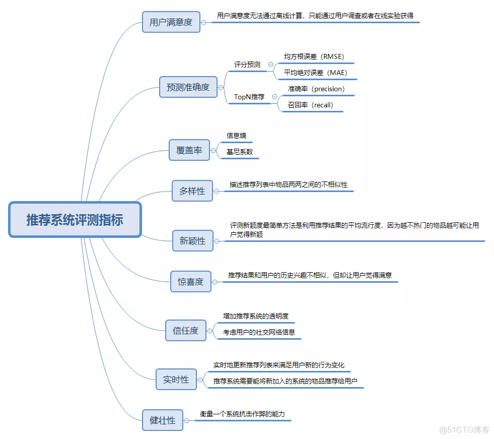

# 一些tips

### 目标思维中的误区：

区分**目标**和**约束**

目标：尽力提高  越高越好

约束：一个阈值

一个信息流产品的目标是提升点击率，但是约束可能是刷新时推荐的多样性，不能一味的追求高多样性，多样性的量化值也不能低于一个阈值。

### 曝光过滤：

如果用户已经看过某个物品，则不再把该物品曝光给该用户

**Bloom filter**

## 评价指标

**AUC**: ROC曲线下方的面积    正例排在负例前的概率

GAUC：Group AUC 阿里提出   计算每个用户的auc，然后加权平均，最后得到group auc，这样就能减少不同用户间的排序结果不太好比较这一影响

#### AUC不适用于召回模型

AUC指标不适用于衡量召回模型。原因有三：

-   计算AUC时，正样本容易获得，可以拿点击样本做正样本。但负样本从哪里来？照搬精排，用曝光未点击做负样本，行不行？不行。否则，测试样本都来自曝光物料，也就是线上系统筛选过的、比较匹配用户爱好的优质物料，这样的测试数据明显与召回的实际应用场景（海量的、和用户毫不相关的物料）有着天壤之别。失真的测试环境只能产生失真的指标，不能反映召回模型的真实水平。（读到这里，细心的读者会意识到，其实粗排也面临类似的问题。严格来讲，凡是曝光过的样本，对粗排来说，也应该算正样本。尽管如此，在实践中，我们仍然拿点击当正样本，拿曝光未点击当负样本，计算GAUC来评估粗排模型。大家都认为，在流程上，粗排比召回离精排更近，因此拿精排的标准来严格要求粗排，也不算太离谱。）
-   那么拿召回结果中，除点击之外的其他物料当负样本，行不行？假设我们为一个用户召回了三个物料，按召回模型的打分降序排列分别为{A,B,C}。历史记录显示只有C被该用户点击过，算正样本。我们认为A和B是负样本，从而计算出AUC=0，是否合理？答案也是否定的。A、B未曾被用户点击过，可能是因为它俩从未向用户曝光过，所以我们不能肯定用户就一定不喜欢它俩，把A、B当负样本太过武断。
-   即便我们能够证明用户真的不喜欢A和B，从而计算出AUC=0，难道我们就能得出该召回模型毫于价值的结论？答案仍然是否定的。毕竟召回算法找到了用户喜欢的物料C，确实发挥了使用。至于C排名靠后，这一点根本不是问题。毕竟召回的顺序并非最终呈现给用户的顺序，把C的位置提前、筛选掉不招用户喜欢的A和B，那是粗排、精排的责任。

基于以上三点原因，在评估召回模型时，我们一般不用AUC这样强调排序性能的指标，也避免直接统计负样本，而是从预测正样本与真实正样本之间的"命中率"、"覆盖度"视角出发来进行评估。

