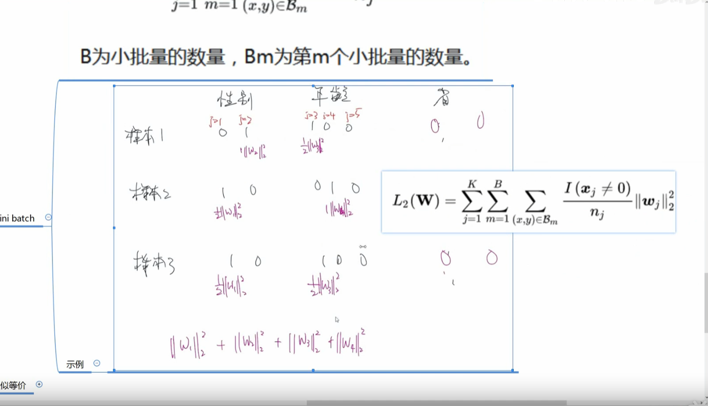
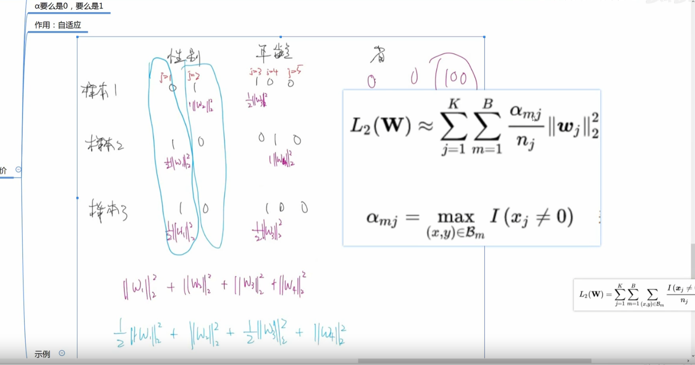

# 模型精学

# DIN

业务特点：电商场景

-   用户兴趣多种多样 &#x20;
-   大量历史行为信息&#x20;
-   &#x20;兴趣往往包含在历史行为中
-   &#x20;用户点不点当前商品很大概率上依赖他的历史行为

平均池化  引入噪声  丢失了感兴趣的数据

sum池化  感兴趣的物品越多  sum pooling 后的向量值越大 &#x20;

**问题：**

为了防止过拟合，  正则化L1 ，L2 ， dropout  效果都不好长尾数据分布  容易加重过拟合

mini-batch  ：只对每个小batch中出现的稀疏特征参数进行L2正则

自适应正则：

出现频率高的特征就给予其比较小的正则化强度，反之则较大的强度

## GBDT+LR

<https://zhuanlan.zhihu.com/p/113350563>
