# 神经网络

## 特征交叉

## FM

二阶交叉特征

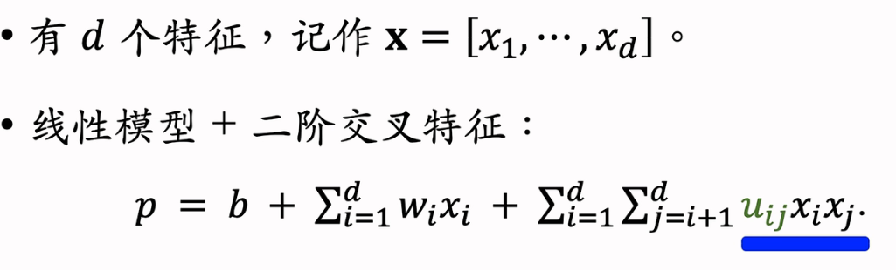

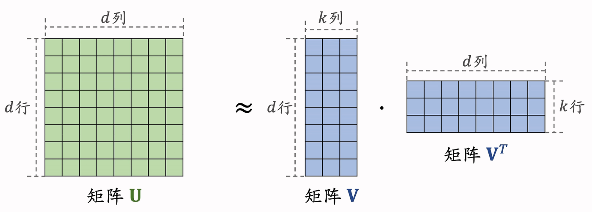

U是uij的矩阵，对U做低秩分解，减少参数量

把uij用vi\*vj近似   就得到了FM

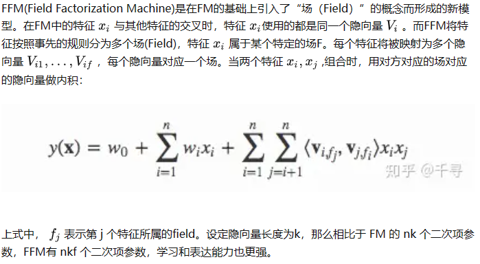

## DCN

**可以用于召回、排序**

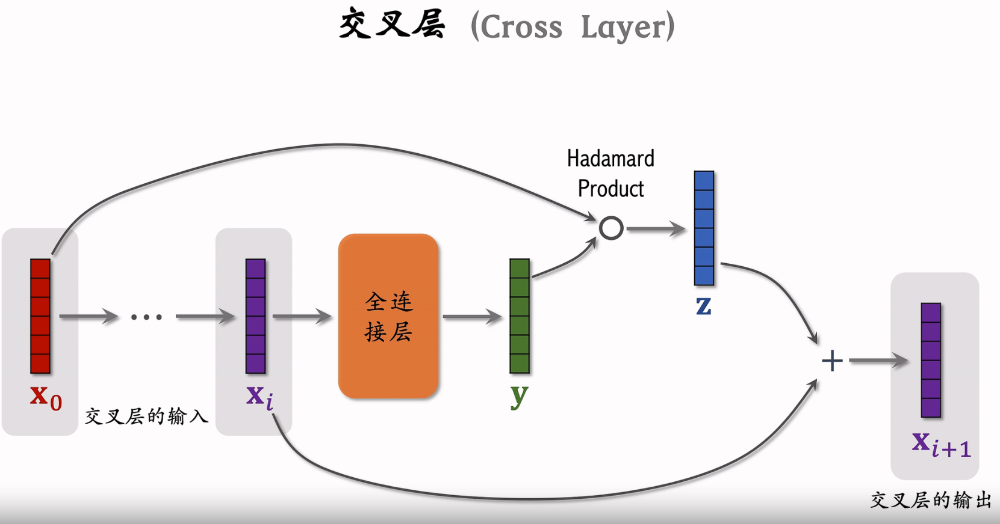

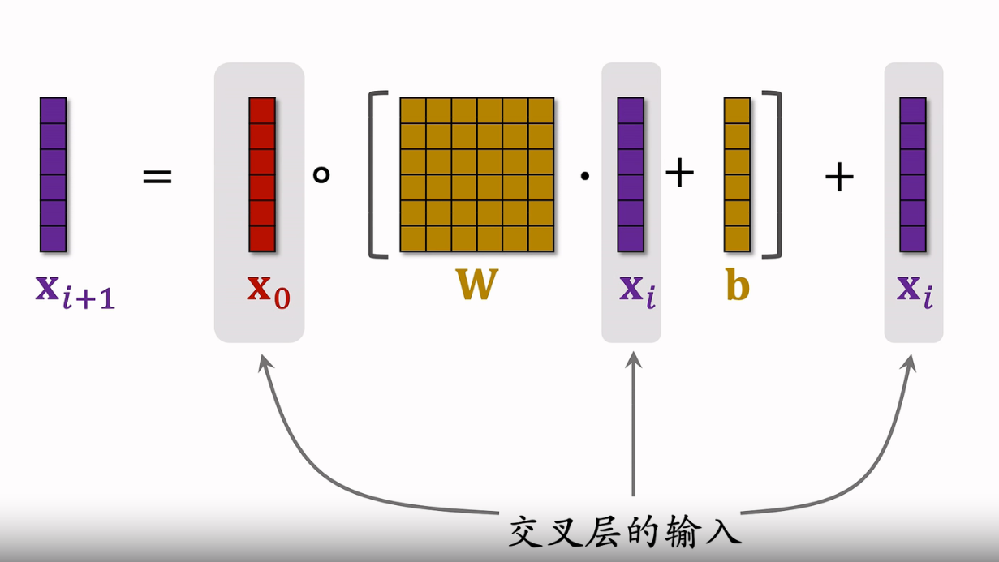

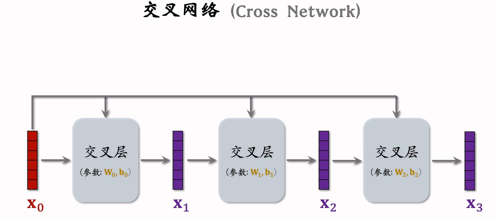

## LHUC

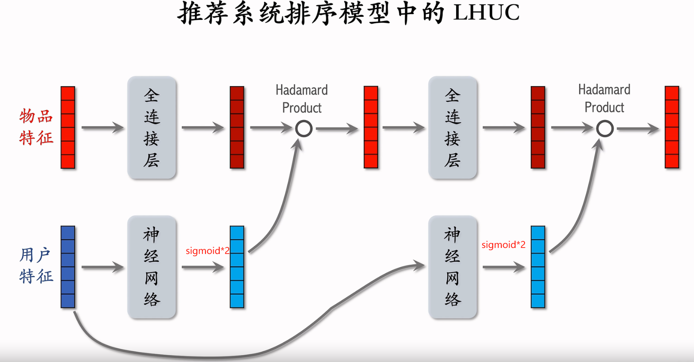

## SENet - 排序

对离散特征做field-wise加权

Field:

-   用户ID Embedding 是64维向量
-   这64个元素就算是一个field    获得相同的权重

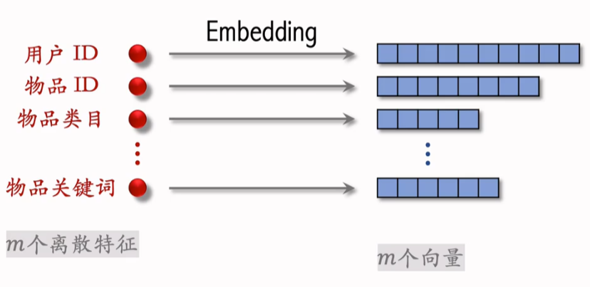

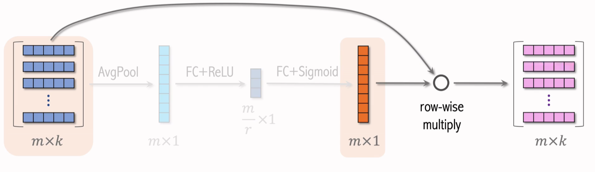

## Bilinear cross&#x20;

**Field间特征交叉**

向量内积

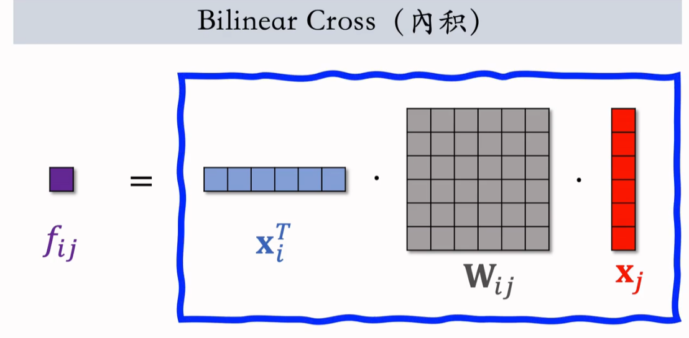

哈达玛乘积

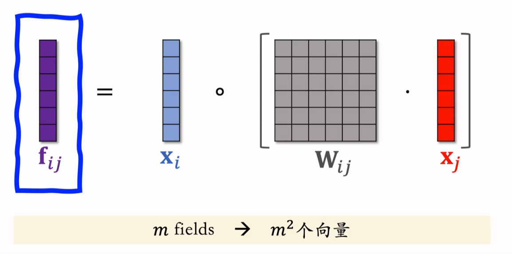
